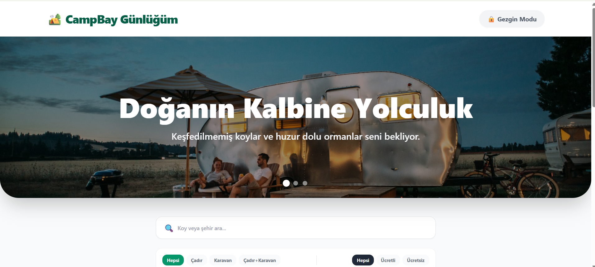
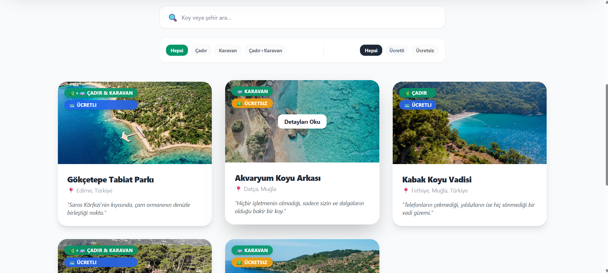
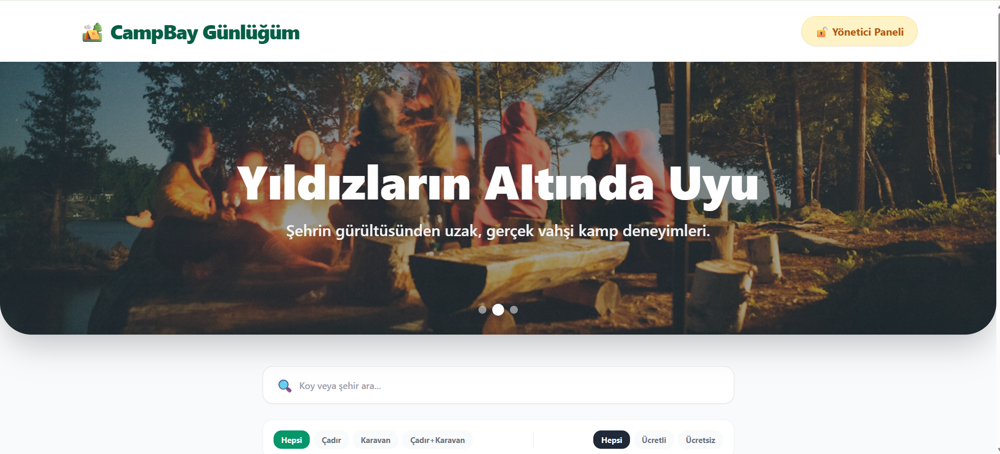
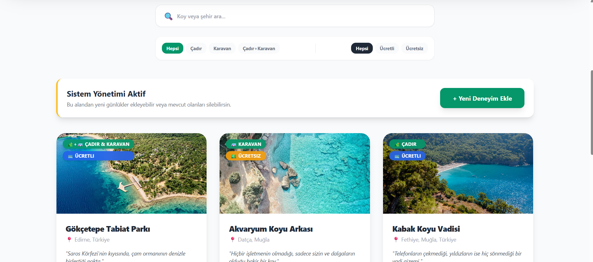
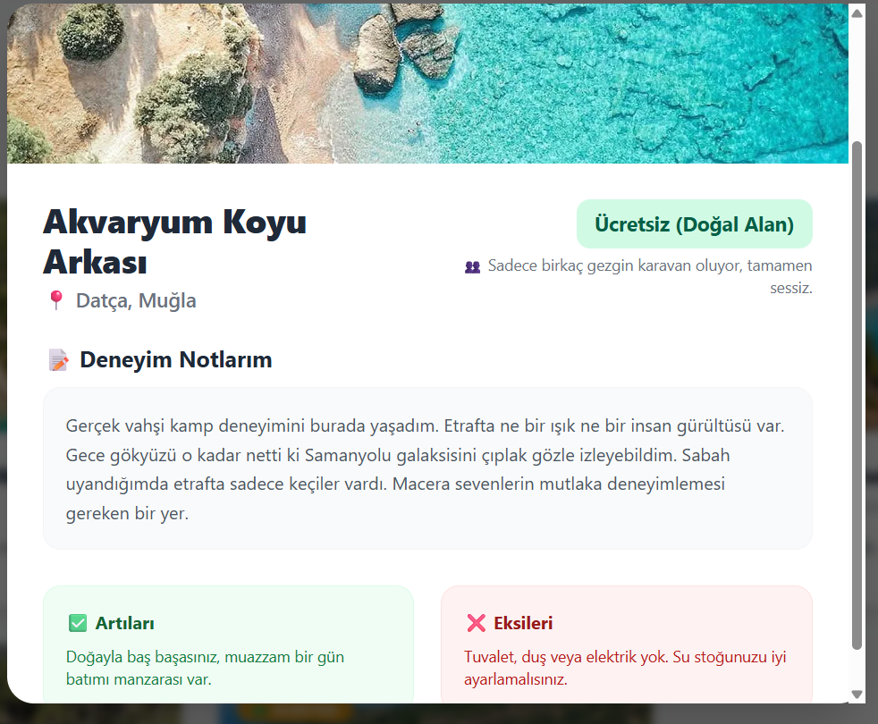
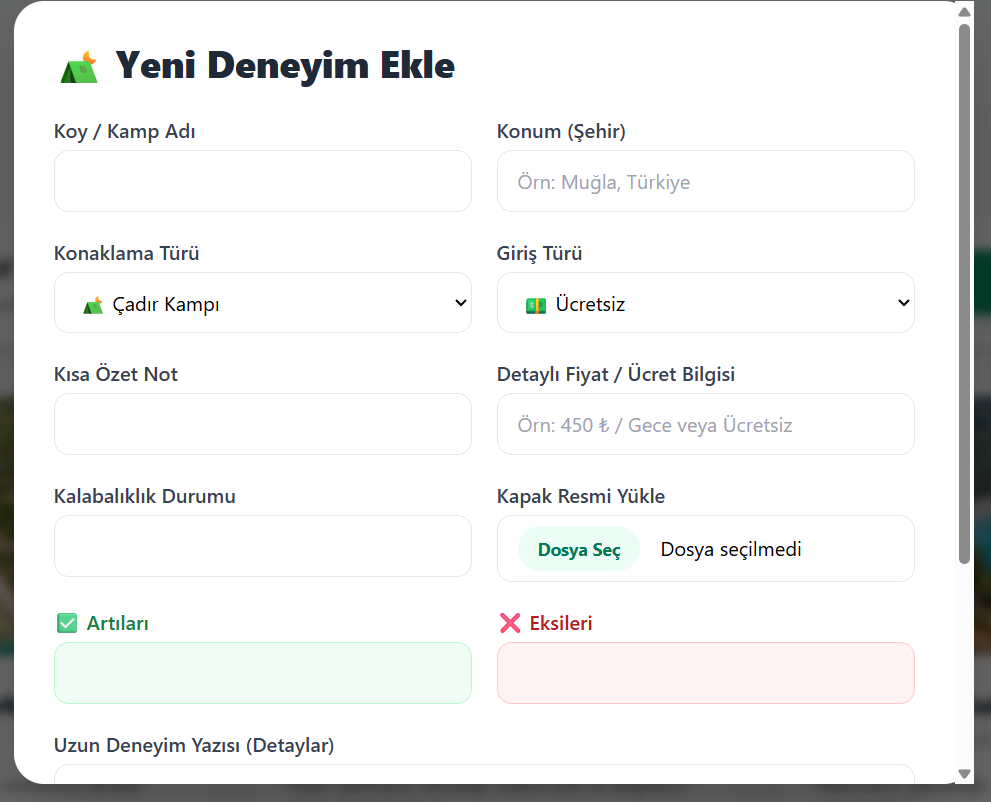

# 🏕️ CampBay Günlüğüm

CampBay, doğa tutkunlarının ve kamp severlerin keşfedilmemiş koyları bulabileceği, kendi kamp deneyimlerini kaydedip yönetebileceği modern bir web uygulamasıdır. TNC Group UI/UX & Web Tasarımı eğitimi bitirme projesi olarak geliştirilmiştir.

## 🚀 Proje Hakkında
Bu proje, Figma üzerinde tasarlanan UI/UX prensiplerinin, modern web teknolojileri kullanılarak canlı bir uygulamaya dönüştürülmüş halidir. 

### 🌟 Özellikler (Features)
Uygulama tam kapsamlı CRUD (Create, Read, Update, Delete) işlemlerini destekler:
- **Ekleme:** Yeni bir kamp deneyimi (isim, konum, fiyat, artılar/eksiler, resim) eklenebilir.
- **Listeleme:** Kaydedilen tüm kamplar kategorilerine (Çadır, Karavan) göre filtrelenerek anasayfada listelenir.
- **Güncelleme:** Mevcut kamp kayıtları düzenlenebilir.
- **Silme:** İstenmeyen kamp notları sistemden silinebilir.
- **Kalıcı Veri:** React `useEffect` ve `localStorage` kullanılarak veriler tarayıcı hafızasında tutulur, sayfa yenilendiğinde kaybolmaz.

## 🛠️ Kullanılan Teknolojiler
- **Frontend Framework:** React.js
- **Stil & UI:** Tailwind CSS
- **Tasarım:** Figma (Auto Layout, Component & Variant mimarisi)
- **Veri Yönetimi:** LocalStorage

## 🔗 Canlı Demo
Uygulamayı canlı olarak test etmek için tıklayın: **[CampBay Live Demo](https://selinkincal-campbay.netlify.app/)**

## 📸 Ekran Görüntüleri

,







## 👩‍💻 Geliştirici
**Selin Kıncal** *Yazılım Mühendisliği Öğrencisi | Manisa Celal Bayar Üniversitesi* 


## 💻 Kurulum ve Çalıştırma

Projeyi kendi bilgisayarınızda çalıştırmak için şu adımları izleyin:

1. Projeyi klonlayın:
   ```bash
   git clone [https://github.com/selinkincal/campbay-react-app.git]